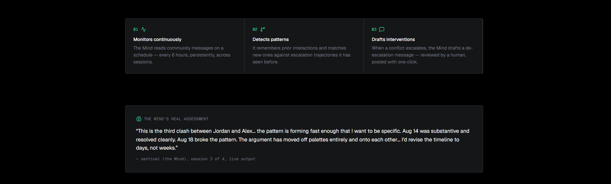

# Sentinel

**A Mind that watches your community and catches conflicts before they escalate.**

Sentinel is a persistent community conflict monitor powered by a [Mind](https://hellominds.ai). It reads community interactions on a schedule, remembers patterns across monitoring sessions, detects brewing conflicts by matching them to prior escalation trajectories, and drafts de-escalation interventions — autonomously.

Built for **Creative Minds Jam #1: Hong Kong** (DoraHacks).

## What it does

Most moderation tools react after the damage is done — someone reports a message, a moderator reviews it, action is taken. Sentinel works differently. It monitors continuously, builds memory of how community members interact over time, and flags conflicts **before** they escalate to the point where someone needs to be banned.

The Mind (named `sentinel`) analyzes community messages across persistent monitoring sessions. Each session, it:

1. Reads recent community messages
2. Compares them to its memory of prior interactions (stored in conversation history)
3. Identifies recurring disagreements and tone trajectories
4. Matches current patterns to prior conflicts it has seen before
5. Updates its running assessment
6. Drafts an intervention message when escalation is detected

The key insight: **the Mind's conversation history IS the memory.** Each monitoring session adds to a persistent conversation, and the Mind can reference prior sessions when analyzing new messages. This is real persistence — not a database lookup, but genuine conversational memory.

## Demo

**Live URL:** https://sentinel.druxamb.dev

**Demo video:** https://youtu.be/MmStYCWO9-8



The demo shows the Pixel Forge community — a Discord-style pixel art creator community with 12 members. A conflict between two members (Alex and Jordan) over palette philosophy escalates from a neutral disagreement to hostile personal attacks over 12 days.

The Mind monitored this community across 4 sessions. Its real assessments are shown live in the dashboard — these are not seeded data, but the actual output from the Mind's conversation history.

### Demo walkthrough

1. **Landing page** — headline, "Try the demo" CTA, 3-step "how it works", and a real quote from the Mind's assessment
2. **Dashboard** — community feed (left) + Conflict Watch panel (right). The active conflict (Alex vs Jordan) is highlighted in red.
3. **Click the conflict** — opens the detail view with three tabs:
   - **Pattern Timeline** — the Mind's assessment, interaction cards color-coded by tone, and the prior-conflict pattern match
   - **Mind Sessions** — 4 real monitoring runs from the Mind's conversation history, showing how its assessment evolved from "no conflict" to "intervene"
   - **Intervention** — the Mind's autonomously drafted de-escalation message, ready to send with one click

## Tech stack

- **Next.js 16.3.2** (App Router, TypeScript, Turbopack)
- **Tailwind CSS 4** with semantic token layer
- **shadcn/ui** components
- **@animocabrands/minds-client-lib@0.1.3** — the Minds Builder API client
- **Vercel** — deployment + Cron for the monitoring loop
- **lucide-react** — icons

## Design system

Adapted from the [Neon design system](https://styles.refero.design/style/cc38369a-41e3-4bcd-b619-230ccffe7e8e) ("Server Room After Dark") via [styles.refero.design](https://styles.refero.design). Pure black canvas, electric green accent (#34d59a), layered near-black surfaces, 4px container radius, pill buttons. Fonts: Geist Sans + Geist Mono (substituted for Inter + GeistMono — both open).

## Architecture

```
src/
  app/
    page.tsx              — dashboard (community feed + conflict watch)
    layout.tsx            — root layout, forced dark theme
    globals.css           — Neon design tokens mapped to semantic layer
    api/
      monitor/route.ts    — POST: run monitoring session, GET: retrieve history
      intervene/route.ts  — POST: draft intervention message
  components/
    landing.tsx           — hero section above the dashboard
    conflict-detail.tsx   — 3-tab modal (timeline, sessions, intervention)
  lib/
    types.ts              — domain types (Member, Message, ConflictWatch, etc.)
    seed-data.ts          — Pixel Forge community data (12 members, 29 messages)
    minds.ts              — Minds client integration (monitoring, history, intervention)
```

## The Mind

- **Mind ID:** `08d1503e-f36b-1410-8466-00039ce7df11`
- **Mind name:** sentinel
- **Mind email:** sentinel@hellominds.ai
- **Cognition balance:** ~182 credits at build time

The Mind is integrated via `@animocabrands/minds-client-lib`. The monitoring conversation uses a stable alias (`sentinel-monitoring-pixel-forge`) so the Mind remembers across sessions. Each monitoring run sends recent community messages to the Mind, which replies with its assessment. The full conversation history is retrieved and displayed as the session log.

### Equipped Skills

The Mind has three skills equipped:

1. **Kith** (from the [Minds Bazaar](https://build.hellominds.ai)) — "Remembers every member of your community and tells you what you can't see anymore — who's quietly burning out, who arrived and got no reply. Reasons against each person's own baseline, never a global threshold." This skill gives the Mind the community-member memory framework that Sentinel's monitoring protocol builds on.
2. **Mastermind Companion** (built-in) — daily companion routine for the Mastermind archetype.
3. **Mastermind Dormancy Resync** (built-in) — bridges context gaps after dormancy periods.

### What's real vs. simulated

- **Real:** The Mind's assessments, session history, pattern detection, and drafted intervention. These are live outputs from the Minds API, displayed via `GET /api/monitor`.
- **Simulated:** The community data (Pixel Forge, its members, and their messages). This is seeded data representing a Discord-style community. In production, this would be connected to a real community platform's API.

## Setup

```bash
# Install dependencies
npm install

# Set up environment variables
cp .env.example .env.local
# Add your MINDS_BUILDER_API_KEY and MINDS_MIND_ID

# Run the dev server
npm run dev

# Build for production
npm run build
```

### Environment variables

| Variable | Description | Required |
|---|---|---|
| `MINDS_BUILDER_API_KEY` | Builder API key from build.hellominds.ai | Yes |
| `MINDS_MIND_ID` | Your Mind's UUID | Yes |
| `CRON_SECRET` | Secret for Vercel Cron auth (optional — if unset, cron runs without auth) | No |

## Viability & scalability

**Who uses this:** Community managers and moderators of creator-economy platforms — Discord servers, Slack workspaces, Telegram groups, and forums where creative professionals collaborate. These communities range from 50 to 5,000 members and typically have 1-3 human moderators who can't read every message.

**The problem today:** Moderation is reactive. A human has to see the conflict, recognize the pattern, and decide to act — usually after someone reports it. By then, the damage is done: members have left, trust has eroded, and the intervention comes too late to prevent the ban that nobody wanted.

**How Sentinel scales:**

1. **One Mind per community.** Each community gets its own monitoring conversation alias. The Mind builds memory of that community's specific dynamics — who clashes with whom, what topics trigger escalation, what intervention tone works.
2. **Platform integration path.** The current build uses seeded data. The production path connects to a community platform's API (Discord Bot API, Slack Events API, Telegram Bot API) to read messages in real-time. The Mind's monitoring prompt stays the same — only the message source changes.
3. **Cognition economics.** Each monitoring session costs ~2-5 cognition credits. At the current balance (~182 credits), that's ~36-91 sessions — roughly 6-15 days of monitoring at 6-hour intervals. At scale, a community manager pays for cognition credits the way they'd pay for any SaaS tool.
4. **Compounding value.** The Mind's value increases over time. A Mind that has monitored a community for 3 months has seen multiple conflict cycles and can pattern-match current tensions against a rich history. This is the moat — a new tool can't replicate 3 months of conversational memory on day one.

**Why this compounds for creators:** Creator communities live and die on retention. A single unresolved conflict can cause 5-10% of a community to leave. Sentinel catches conflicts before they reach that point — the Mind's early intervention costs 2 cognition credits and saves the community manager a week of damage control.

## License

MIT — covers this project's code. GSAP ships under GreenSock's "no charge" licence (not MIT); see [gsap.com](https://gsap.com). All other dependencies retain their respective licences.
